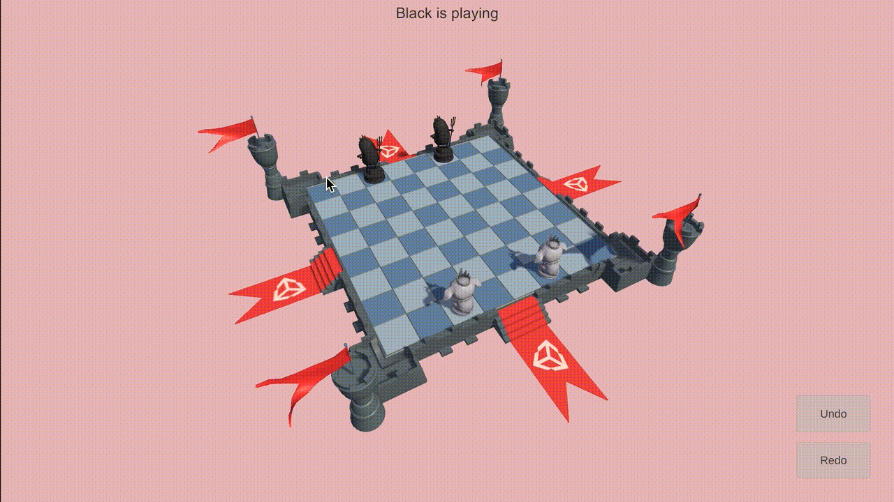

# Command Pattern

A Unity project to aimed to illustrate the Command Pattern through the implementation of a Undo/Redo functionality in a turn based game, where you can move and capture pieces.

## What is this pattern?

The Command Pattern is a design pattern (a template for how to solve a programming problem) that encapsulates all of the information about a specific action or event, and sets it up so it can be called at a later time by any other script. This keeps the code clean and isolated, and simplifies the process of calling the action or event. An added benefit is that any script calling on the command doesn’t need to know anything about the command itself. It simply makes the call, and the rest is taken care of.

## Where to run?

Project updated to run on Unity 2021.2.10f1

## Learn more

Based on this [Unity Learn project](https://learn.unity.com/tutorial/command-pattern#)